<h1 align="center">API RESTFUL - Bestiario de rol clásico</h1>

## Descripción
Esta API RESTful es una práctica de Laravel 12 para la asignatura de PHP/DAW. Permite gestionar un bestiario de criaturas del rol clásico con operaciones CRUD (crear, leer, actualizar y eliminar criaturas) y autenticación mediante ``Laravel Sanctum (token based)``.

## Tecnologías usadas
<table align="center">
<tr>
<td align="center">
  
  <br>
  <strong>Laravel 12</strong>
</td>
<td align="center">
  
  <br>
  <strong>Postman</strong>
</td>
</tr>
</table>

## Requisitos previos
1. Servidor Apache
2. Php versión ``8.3 o superior``
3. MySQL versión ``8.0``

## Instalación
1. Clone el repositorio:
   ```bash
   git clone https://github.com/cjag99/bestiaryAPI.git
   ```
2. Instale dependencias:
   ```bash
   composer install
   ```
3. Crea el fichero ``.env`` con el siguiente comando:
   ```bash
   cp .env.example .env
   ```
5. Cambie las variables de entorno de conexión a base de datos del fichero ``.env`` siguiendo los ejemplos de ``.env.example``:
   ```.env
   DB_CONNECTION=mysql
   DB_HOST=your_host
   DB_PORT=your_port
   DB_DATABASE=your_database
   DB_USERNAME=your_usernamme
   DB_PASSWORD=your_password
   ```
6. Realizar la migración de base de datos y el sembrado de datos de ejemplo para la api:
   ```bash
   php artisan migrate --seed
    ```
7. Con esto estaría todo listo. Solo quedaría iniciar la API con el comando:
   ```bash
   php artisan serve
   ```

## Autenticación con Laravel Sanctum
Esta API utiliza ``Laravel Sanctum`` para gestionar la autenticación mediante tokens personales, permitiendo proteger las rutas de la API y garantizar que solo los usuarios autenticados puedan acceder a ellas.
 * **Generación del token:**
      El proceso de autenticación comienza con una petición al endpoint de login:
      ```http
      POST /api/login
      ```
      El usuario envía sus credenciales (``email`` y ``password``). Si son correctas, la API genera un token de acceso asociado a ese usuario mediante Sanctum.
      
      **Ejemplo de respuesta:**
      ```JSON
        {
            "status":1,
            "message": "1|eyJ0eXAiOiJKV1QiLCJh..."
        }
      ```
      Este token se almacena en la base de datos y representa una sesión de autenticación independiente del navegador o dispositivo.
  * **Uso del token en la API:**
     Para acceder a las rutas protegidas, el cliente debe enviar el token en cada petición HTTP usando el header:
     ```http
     Authorization: Bearer {token}
     ```
     De esta forma, la API puede identificar al usuario en cada request sin necesidad de sesiones ni cookies.
* **Protección de rutas:**
  Las rutas que requieren autenticación están agrupadas bajo el middleware:
  ```php
  Route::middleware('auth:sanctum')->group(function () {
    // rutas protegidas
    });
  ```
  Este middleware valida el token enviado y permite el acceso únicamente si es válido. En caso contrario, la API devuelve una respuesta JSON con código 401 (Unauthenticated).
* **Ventajas del uso de Sanctum:**
  + Autenticación stateless (sin sesiones)
  + Uso de tokens seguros
  + Ideal para APIs REST
  + Fácil integración con Laravel
  + Control de acceso claro y centralizado
* **Gestión de errores:**
  Cuando un usuario intenta acceder a una ruta protegida sin un token válido, la API responde con:
  ```JSON
  {
  "message": "Unauthenticated."
    }
    ```
  y un código de estado HTTP 401, garantizando un comportamiento consistente en toda la API.

## Flujo de uso de la API
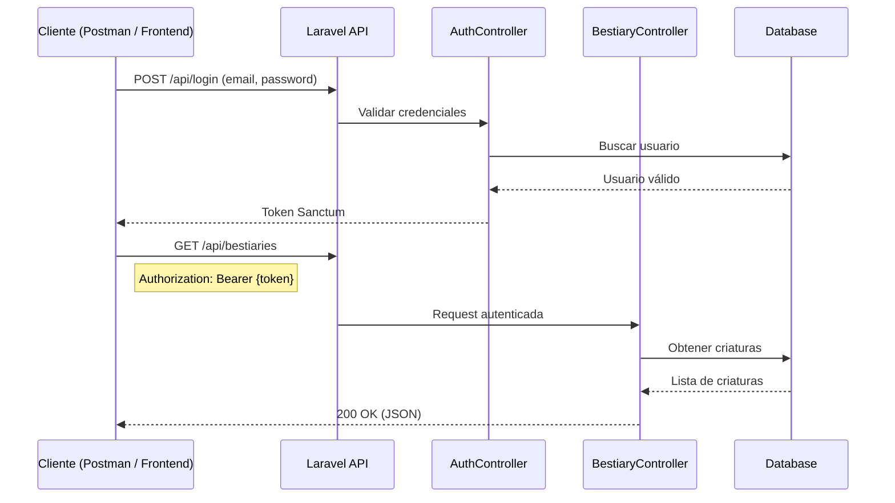
## Endpoint de la API
* **POST /api/login:**
    + Descripción: Autentica al usuario y genera un token Sanctum.
    + Parámetros: 
        - email (string, requerido): Correo electrónico del usuario.
        - password (string, requerido): Contraseña del usuario.
    + Respuesta exitosa (200 OK):
    ```JSON
    {
        "status": 1,
        "message": "1|eyJ0eXAiOiJKV1QiLCJh..."
    }
    ```
    + Respuesta de error (401 Unauthorized):
    ```JSON
    {
        "status": 0,
        "message": "Credenciales inválidas."
    }
    ``` 
    + Captura de pantalla:
    
<table align="center">
<tr>
<td align="center">
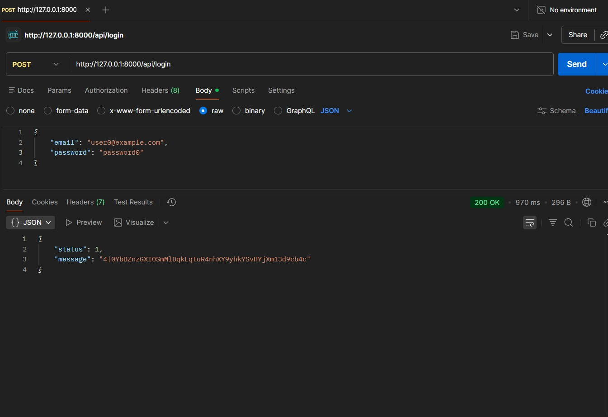
<br>
<strong>Respuesta exitosa</strong>
</td>       
<td align="center">
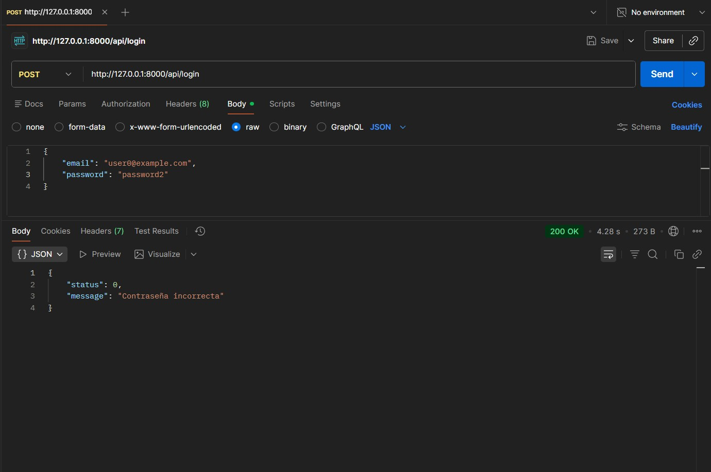
<br>
<strong>Respuesta de error</strong>
</td>
</tr>
</table>

* **GET /api/bestiaries:** 
    + Descripción: Obtiene la lista de criaturas del bestiario. Permite filtrar mediante parámetros de consulta.
    + Parámetros de consulta (opcional): Vienen definido s en el modelo Bestiary.php:
    ```php
    $allowedFilters = [
            'name',
            'species',
            'danger_level',
            'habitat',
            'is_hostile',
        ];
    ```
    + Respuesta exitosa (200 OK):
    ```JSON
    {
        "status": 1,
        "message": "Criaturas obtenidas exitosamente.",
        "data": [
            {
                "id": 1,
                "name": "Criatura 1",
                "species": "Especie 1",
                "danger_level": "Bajo",
                "habitat": "Selva",
                "is_hostile": false
            },
            ...
        ]
    }
    ```
    + Respuesta de error (401 Unauthorized):
    ```JSON
    {
        "message": "Unauthenticated." 
    }
    ```
    + Captura de pantalla:  
    <table align="center">
    <tr>
    <td align="center">
    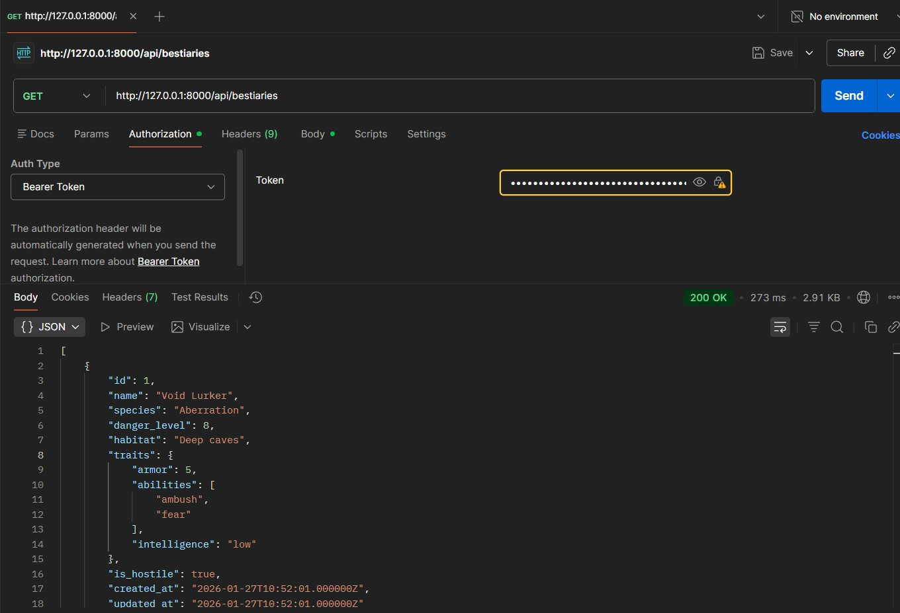
    <br>
    <strong>Respuesta exitosa</strong>
    </td>
    <td align="center">         
    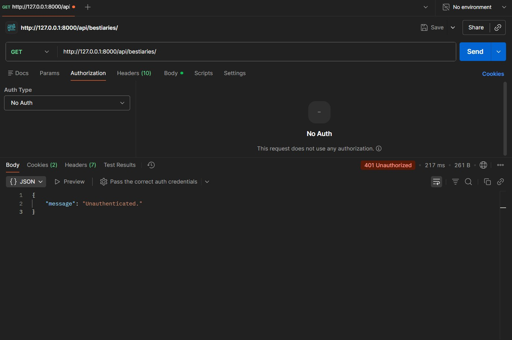
    <br>            
    <strong>Respuesta de error</strong>
    </td>
    </tr>
    </table>
* **GET /api/bestiaries/{id}:** 
    + Descripción: Obtiene los detalles de una criatura específica.
    + Parámetros de ruta:
        - id (integer, requerido): ID de la criatura.
    + Respuesta exitosa (200 OK):
    ```JSON
    {
        "status": 1,
        "message": "Criatura obtenida exitosamente.",
        "data": {
            "id": 1,
            "name": "Criatura 1",
            "species": "Especie 1",
            "danger_level": "Bajo", 
            "habitat": "Selva",     
            "is_hostile": false
        }
    }
    ```
    + Respuesta de error (404 Not Found):
    ```JSON
    {
        "status": 0,
        "message": "Criatura no encontrada."
    }
    ```
    + Captura de pantalla:
    <table align="center">
    <tr>
    <td align="center">
    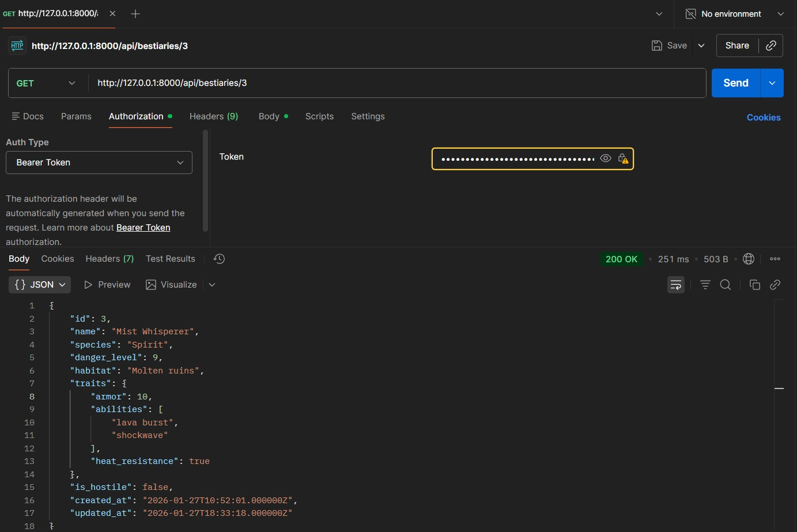
    <br>
    <strong>Respuesta exitosa</strong>
    </td>
    <td align="center">         
    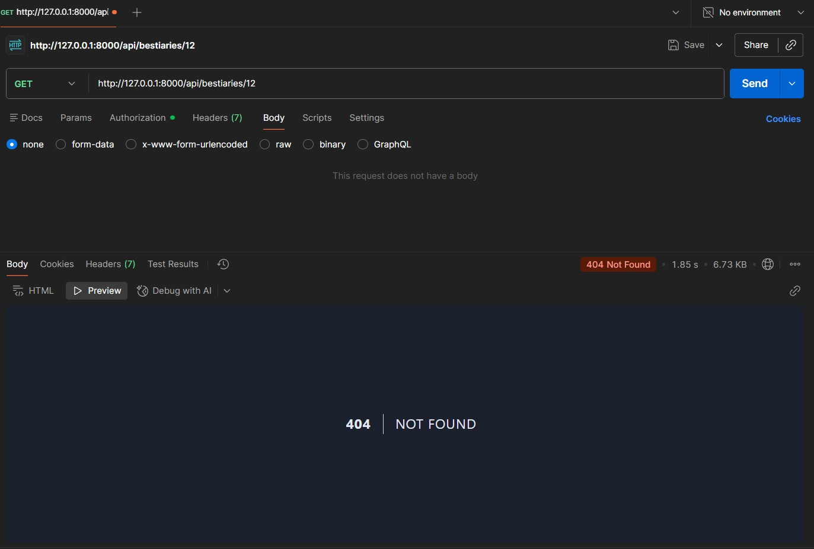
    <br>    
    <strong>Respuesta de error</strong>
    </td>
    </tr>
    </table>
* **POST /api/bestiaries:** 
    + Descripción: Crea una nueva criatura en el bestiario.
    + Parámetros del cuerpo (JSON):
        - name (string, requerido): Nombre de la criatura.
        - species (string, requerido): Especie de la criatura.
        - danger_level (string, requerido): Nivel de peligro (Bajo, Medio, Alto).
        - habitat (string, requerido): Hábitat natural de la criatura.
        - is_hostile (boolean, requerido): Indica si la criatura es hostil.
    + Respuesta exitosa (201 Created):
    ```JSON
    {
        "status": 1,
        "message": "Criatura creada exitosamente.",
        "data": {
            "id": 2,
            "name": "Criatura 2",
            "species": "Especie 2",
            "danger_level": "Medio",       
            "habitat": "Selva",
            "is_hostile": true
        }
    }
    ```
    + Respuesta de error (422 Unprocessable Entity):
    ```JSON
    {
        "status": 0,
        "message": "Error de validación.",
        "errors": {     
            "name": ["El campo nombre es obligatorio."],
            ...
        }
    }
    ```
    + Captura de pantalla:  
    <table align="center">
    <tr>
    <td align="center">
    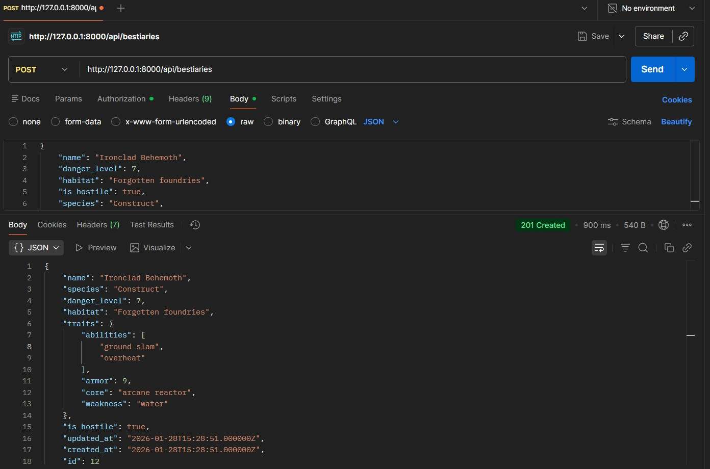
    <br>
    <strong>Respuesta exitosa</strong>
    </td>
    <td align="center">
    
    <br>    
    <strong>Respuesta de error</strong>
    </td>
    </tr>
    </table>
* **PUT /api/bestiaries/{id}:** 
    + Descripción: Actualiza una criatura existente.
    + Parámetros de ruta:
        - id (integer, requerido): ID de la criatura a actualizar.
    + Parámetros del cuerpo (JSON):
        - name (string, opcional): Nombre de la criatura.
        - species (string, opcional): Especie de la criatura.
        - danger_level (string, opcional): Nivel de peligro (Bajo, Medio, Alto).
        - habitat (string, opcional): Hábitat natural de la criatura.
        - is_hostile (boolean, opcional): Indica si la criatura es hostil.
    + Respuesta exitosa (200 OK):
    ```JSON
    {
        "status": 1,       
        "message": "Criatura actualizada exitosamente.",
        "data": {
            "id": 1,
            "name": "Criatura 1 Actualizada",
            "species": "Especie 1",
            "danger_level": "Alto",       
            "habitat": "Montaña",
            "is_hostile": true
        }
    }
    ```
    + Respuesta de error (404 Not Found):
    ```JSON
    {
        "status": 0,
        "message": "Criatura no encontrada."
    }
    ```
    + Captura de pantalla:
    <table align="center">
    <tr>
    <td align="center">
    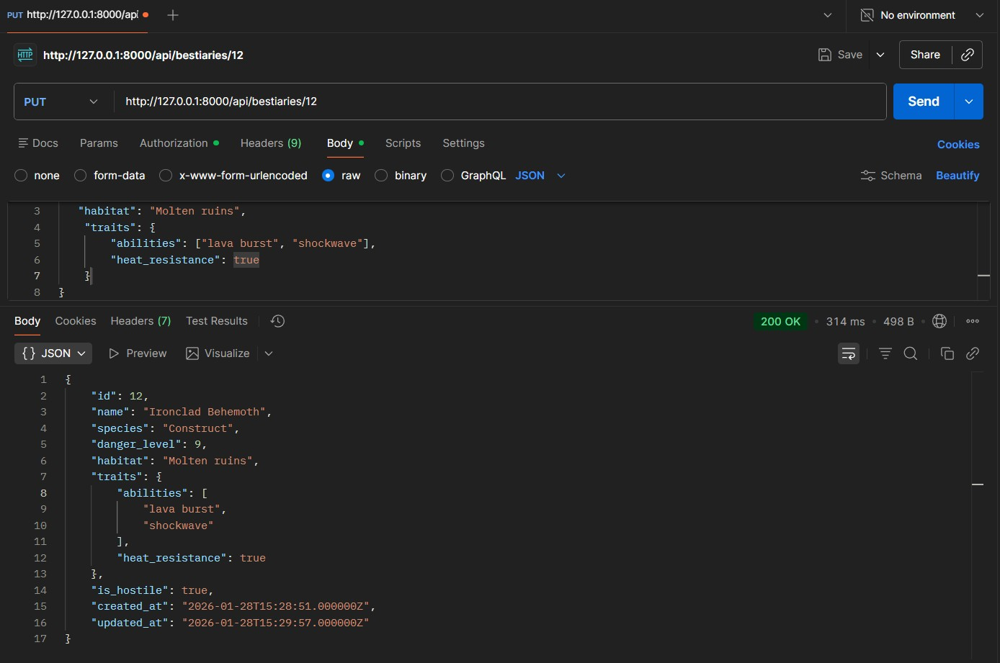
    <br>
    <strong>Respuesta exitosa</strong>
    </td>
    <td align="center">
    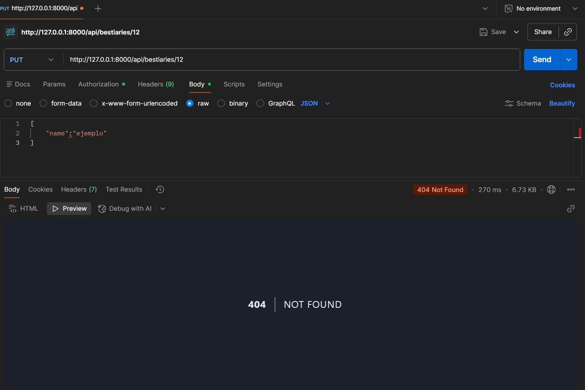
    <br>    
    <strong>Respuesta de error</strong>
    </td>
    </tr>
    </table>

* **DELETE /api/bestiaries/{id}:** 
    + Descripción: Elimina una criatura del bestiario.  
    + Parámetros de ruta:
        - id (integer, requerido): ID de la criatura a eliminar.
    + Respuesta exitosa (204 No Content):
    ```JSON
    {
        "status": 1,
        "message": "Criatura eliminada exitosamente."
    }
    ```
    + Respuesta de error (404 Not Found):
    ```JSON
    {
        "status": 0,
        "message": "Criatura no encontrada."
    }
    ```
    + Captura de pantalla:
    <table align="center">
    <tr>
    <td align="center">
    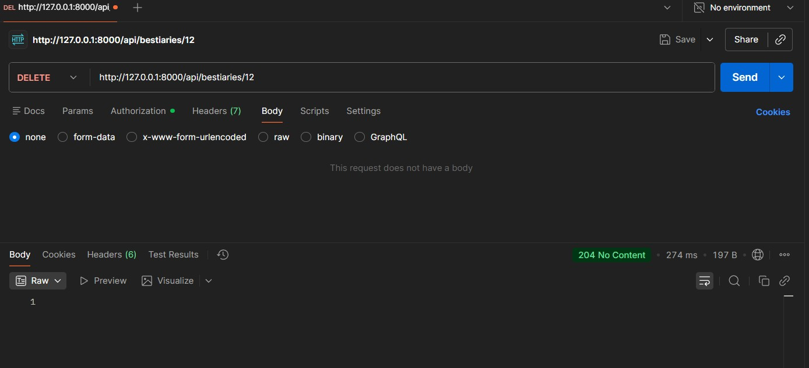
    <br>
    <strong>Respuesta exitosa</strong>
    </td>
    <td align="center">
    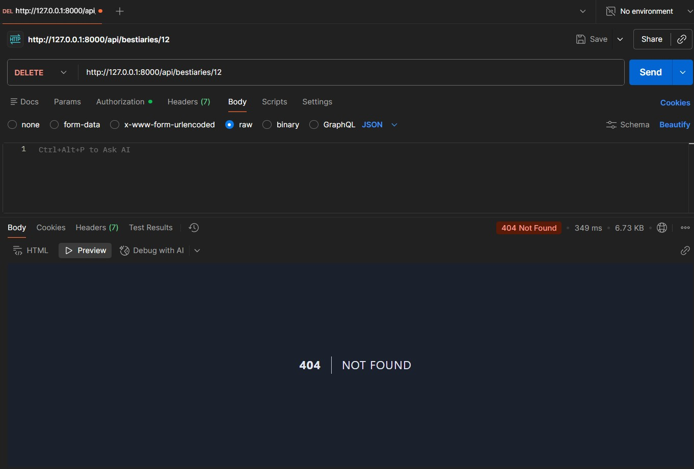
    <br>    
    <strong>Respuesta de error</strong>
    </td>
    </tr>
    </table>
